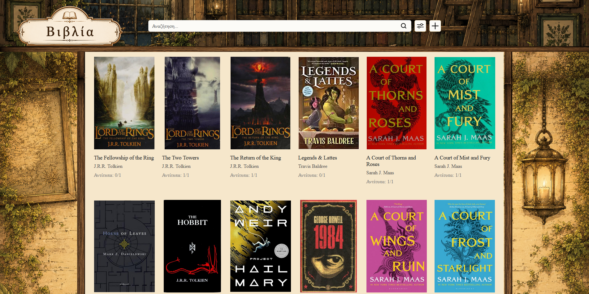
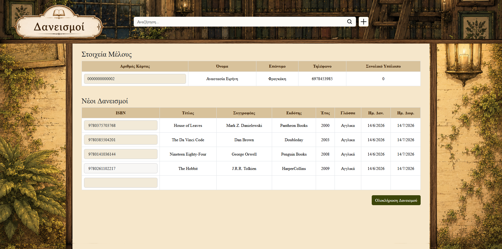

# library_system
# 📚 Green Hill Library

A modern Library Management System developed with **Flask**, **SQLAlchemy** and **MySQL**.

The application provides a complete environment for managing books, members, borrowings and returns, while also integrating with the **Open Library API** for automatic book information retrieval through ISBN.

---

# 📖 Table of Contents

* Features
* Technologies
* Screenshots
* Installation
* Project Structure
* API Integration
* Future Improvements

---

# ✨ Features

## 📚 Book Management

* Add new books
* Edit existing books
* Delete books
* Upload custom book covers
* Automatic ISBN lookup
* Automatic book information retrieval
* Search books by title or author
* Filter by category, language, publication year and availability

## 👥 Member Management

* Add members
* Edit member information
* Delete members
* Automatic library card number generation
* Search by card number
* Search by first and last name

# 🌐 API Integration

The application uses the **Open Library API** to automatically retrieve:

* Book title
* Author
* Publisher
* Categories
* Description
* Cover image
* Publication year
* Language

using only the ISBN number.

## 📷 Barcode Support

- ISBN barcode scanning
- Library card barcode scanning
- Automatic form completion
- Fast borrowing workflow

## 🔄 Borrowing System

* Create new borrowings
* Borrow multiple books at once
* Automatic due date calculation
* Automatic availability update
* Barcode scanner support
* Library card scanner support

## 📥 Return System

* Return borrowed books
* Automatic overdue detection
* Automatic fine calculation
* Fine payment tracking

## 🔍 Smart Search

Depending on the current page:

* Book search
* Member search
* Borrowing search
* Return search

## 🎨 User Interface

* Custom designed home page
* Custom library card layout
* Responsive Bootstrap components
* Custom CSS styling

---

# 🛠 Technologies

## Backend

* Python
* Flask
* SQLAlchemy
* MySQL

## Frontend

* HTML
* CSS
* JavaScript
* Bootstrap
* Tom Select

## External Services

* Open Library API

## Development Tools

* Visual Studio Code

---

# 🖼 Screenshots

## Home Page


## Books



## Add Members


## Loans



---

# 🚀 Getting Started

```bash
git clone https://github.com/USERNAME/library_system.git

pip install -r requirements.txt

python app.py
```

---

# 🚀 Future Improvements

* User authentication
* Reservation system
* Dashboard with statistics
* Email notifications
* Export reports

---

# 👨‍💻 Author

Developed as a personal software development project.


